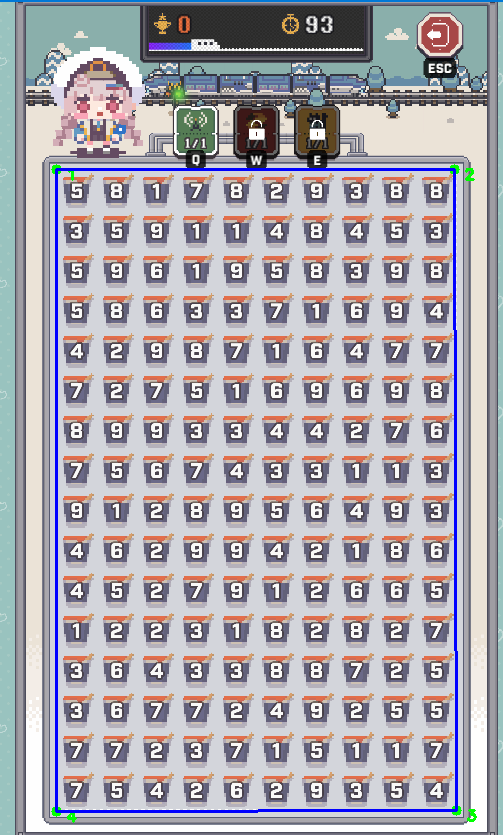

# Sum10 Nikke 自动化与分析系统

## 📖 项目简介
  

**sum10_Nikke** 是一个专为 Nikke 游戏中的 "Sum10"（凑十）小游戏设计的全栈自动化解决方案。本项目集成了计算机视觉（OCR）、深度学习模型训练、高性能求解算法（God Brain）以及 Web 可视化交互界面，旨在实现从游戏画面识别到最优策略执行的全自动化流程。
   
   
   
  
   
核心功能包括：
- **高精度视觉识别**：基于 CNN 的数字识别模型，适应游戏内的各种视觉干扰。
- **智能决策大脑**：多线程并行求解器，具备 "时光倒流"（S/L）和动态算力分配机制，追求 100% 清盘率。
- **可视化训练平台**：Web 端的样本标注与模型微调工具，方便持续优化识别准确率。
- **实时监控**：通过 WebSocket 连接的 Web 前端，实时展示计算过程和最优解。

## 📂 目录结构说明

```
sum10_Nikke/
├── eyes/                       # 👁️ 视觉感知模块
│   ├── coordinate_picker.py    # 坐标拾取工具（用于初始化游戏区域）
│   ├── auto_capture.py         # 自动截图与图像预处理
│   ├── Sum10_Labeling_Tool/    # 核心模型训练与推理代码
│   └── ...
├── Head/                       # 🧠 策略大脑模块
│   ├── god_brain.py            # 主程序：集成 OCR 与 求解算法 (V7.1)
│   ├── Head_web.html           # 求解器控制台（前端界面）
│   ├── deep_dive.py            # 深度搜索策略
│   └── ...
。。。
```

## 🚀 快速开始

### 1. 环境准备

确保已安装 Python 3.8+。建议使用虚拟环境：

```bash
# 创建虚拟环境
python -m venv .venv

# 激活虚拟环境 (Windows)
.venv\Scripts\activate

# 安装依赖
pip install -r requirements.txt
# 如果没有根目录 requirements.txt，请分别安装各模块依赖：
# pip install fastapi uvicorn websockets opencv-python numpy pillow torch torchvision flask pydirectinput
```

### 2. 初始化配置 (首次运行)

在运行自动化程序前，需要告诉程序游戏窗口在哪里。
注：CNN模型使用本人电脑的游戏窗口的10*16棋盘两轮320张数字图片进行训练，不保证在其他环境能够正常使用。如果你想使用，请自身具备相关知识技能或者一个靠谱的 AI 助手。

1. 运行坐标拾取工具：
   ```bash
   python eyes/coordinate_picker.py
   ```
2. 按照提示，依次点击游戏棋盘的 **左上、右上、右下、左下** 四个角。
3. 配置文件将自动保存至 `eyes/board_coordinates.txt`。




按完4个点之后按回车，不想打点就按Q退出。完事问你看不看透视选N不看

### 3. 启动自动化大脑 (God Brain)

这是项目的主程序，负责识别屏幕并计算最优解。

1. 启动后端服务：
   ```bash
   python Head/god_brain.py
   ```
   *控制台将显示 "Sum10 God Brain V7.1 ... 启动中"*

2. 打开前端界面：
   在浏览器中直接打开 `Head/Head_web.html` 文件。

3. **操作说明**：
   - 在网页上连接 WebSocket（通常自动连接）。
   - 调整 **Threads** (线程数) 以利用多核 CPU 加速计算。
   - 点击 **演算按钮** 开始演算。  

4. 神之手是推导后的执行器，它在推导结束之前无法进行作业。
它依赖webui识别的棋盘大小进行反推，估算各个数字所在的位置。
使用前需要将四个角定位在棋盘中四个角落的数字上而不是棋盘的四周（区别于视觉），默认兼容3个棋盘（只要你自己重新标注）

因为我没有独立显卡，所以没加 N 卡加速，你可以自己加

### 4. 模型微调 (可选)

如果发现识别准确率下降，可以使用 Web 工具进行样本收集和重新训练。

1. 启动标注工具：
   ```bash
   cd eyes/Sum10_Labeling_Tool
   python app.py
   ```
2. 访问 `http://127.0.0.1:5000`。
3. 使用 **Labeling Mode** 快速标注新截图

## 🛠️ 核心技术栈

- **后端框架**: FastAPI (God Brain), Flask (Web Tool)
- **通信协议**: WebSockets (实时前后端通信)
- **计算机视觉**: OpenCV, PyTorch (CNN 模型)
- **自动化控制**: PyDirectInput (模拟鼠标/键盘操作)
- **并发处理**: Python Multiprocessing (多核并行求解)

## ⚠️ 注意事项

- **Windows DPI 设置**: 请确保系统缩放设置与程序兼容，或在程序启动时注意 DPI 感知提示。
- **管理员权限**: 模拟输入 (`pydirectinput`) 可能需要以管理员身份运行终端。
- **分辨率**: 建议游戏窗口保持固定分辨率，以免坐标失效。


## ⚖️ 许可证 (License)

本项目仅供学习与技术研究使用。

## 🛡️ 免责声明 (Disclaimer)

1.  **非商业用途**：本项目仅用作计算机视觉和算法优化课题研究，**严禁用于任何商业用途**。
2.  **免责条款**：作者不对使用本程序导致的任何后果（包括但不限于账号封禁、数据丢失等）负责。
3.  **停止维护**：作者不会针对本程序再做任何更新。
4.  **算法说明**：程序中使用到的算法主要由 Gemini 编写，算力优化和逻辑并非绝对的最优解。V6 版本曾尝试添加多种复杂逻辑，但效果未达预期，故本项目可视作最终版本（绝唱）。
5.  **引用说明**：如有引用或基于本项目进行二次开发，请务必注明出处。

**使用本程序即代表您已阅读并同意上述条款。**


---
*Powered by Gemini 3 Pro, debugged by small-tailqwq*